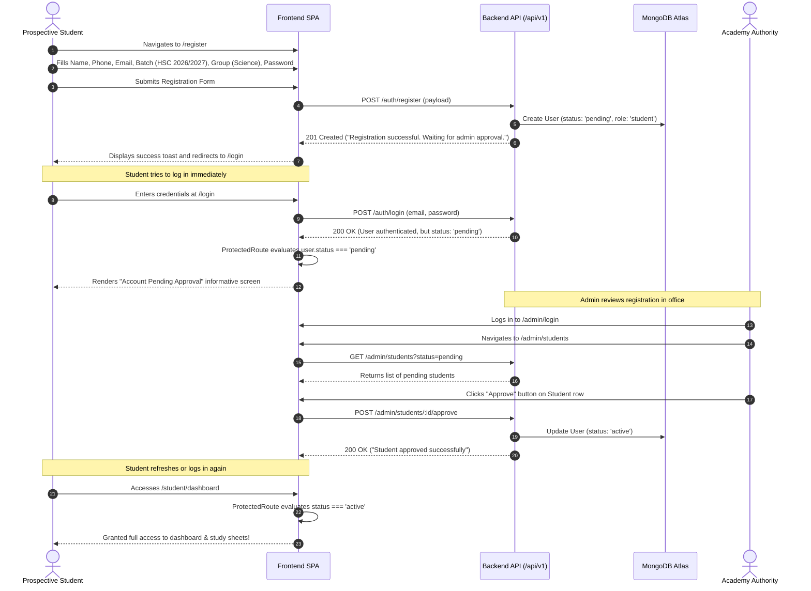
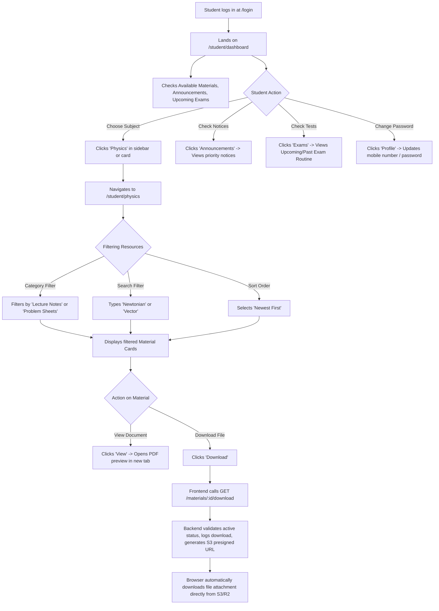
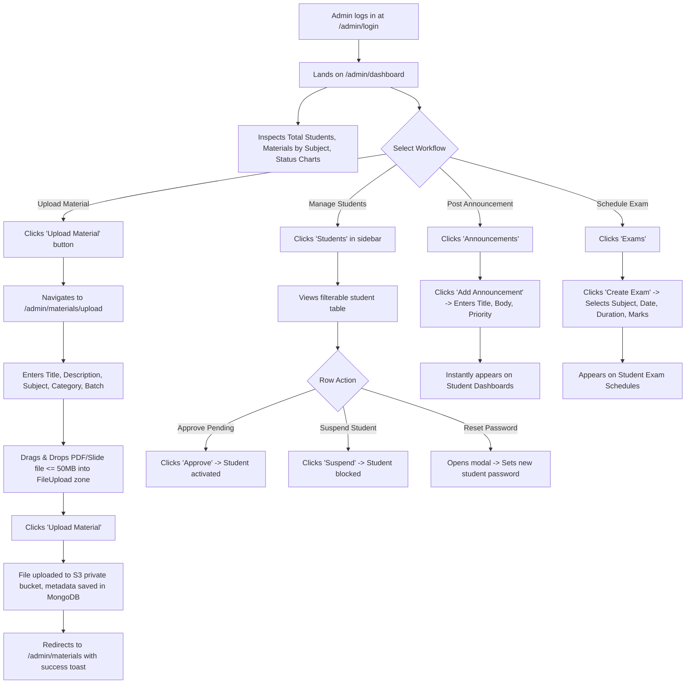
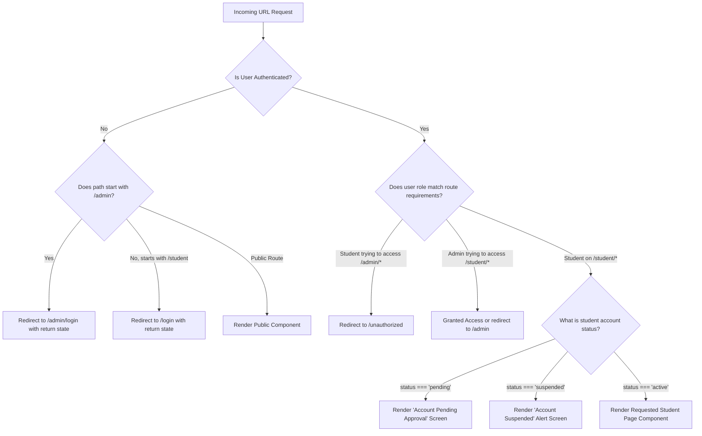

# 🗺️ App Flow & User Journey Map
## Project: A-Cube Academy Web Application
**Document Version:** 1.0.0  
**Scope:** Complete Navigation Pathways, State Transitions, Screen Interactions, and Guard Behavior

---

## 1. Global Sitemap & Route Hierarchy

```text
/ (Public Website)
├── / (Home / Landing Page)
│    ├── #home (Hero Section)
│    ├── #about (Academy Pedagogical Mission)
│    ├── #subjects (Physics, Math, ICT Cards)
│    ├── #features (7 Authentic Leaflet Features)
│    ├── #teachers (Faculty Credentials)
│    ├── #how-it-works (4-Step Learning Journey)
│    ├── #cta (Student Portal Promotion)
│    └── #contact (Location, Phone, WhatsApp, Maps)
│
├── /login (Student Authentication Gateway)
├── /admin/login (Dedicated Administrator Authentication Gateway)
├── /register (Student Enrollment Registration)
├── /forgot-password (Password Recovery Initiation)
└── /reset-password/:token (Secure Password Reset Form)

/student/* (Student Portal - Guarded: Requires role: 'student' & status: 'active')
├── /student/dashboard (Personalized Dashboard, Metrics, Recent Files)
├── /student/profile (Profile dossier, Batch update, Password change)
├── /student/physics (Physics Library: Lecture Notes, Problem Sheets, Slides)
├── /student/math (Math Library: Formulas, Calculus, Geometry Sheets)
├── /student/ict (ICT Library: Digital Devices, C-Programming Notes)
├── /student/materials (Consolidated All-Subject Resource Directory)
├── /student/announcements (Official Academy Notice Board)
├── /student/exams (Exam Schedules: Upcoming & Past Test Routines)
└── /student/settings (UI Preferences & Security)

/admin/* (Admin Console - Guarded: Requires role: 'admin')
├── /admin/dashboard (Executive Overview, Analytics Charts, Live Feeds)
├── /admin/students (Student Directory: Search, Filter, Approve, Suspend)
├── /admin/students/:id (Detailed Student Dossier & Password Reset)
├── /admin/materials (Material Catalogue, File Previews, Downloads, Deletions)
├── /admin/materials/upload (S3 Cloud Upload Form with Progress Bar)
├── /admin/materials/:id/edit (Material Metadata Editor)
├── /admin/teachers (Faculty Profiles CRUD)
├── /admin/subjects (Subject Configuration & Ordering)
├── /admin/announcements (Notice Publisher & Priority Tagger)
├── /admin/exams (Exam Routine Scheduler & Marks Definition)
├── /admin/settings (Institute Metadata: Name, Hotline, Address)
└── /admin/profile (Admin Account & Security Settings)

/error/* (System Pages)
├── /unauthorized (403 Forbidden Error Screen)
└── /* (404 Page Not Found Screen)
```

---

## 2. End-to-End User Journeys

### 2.1 Journey 1: Public Prospective Student / Guardian
**Goal:** Discover A-Cube Academy, inspect faculty credentials, understand teaching methodology, and initiate contact or enrollment.

```mermaid
flowchart TD
    Start([Visitor lands on /]) --> Hero[Views Hero: Headline, Tagline, Badges]
    Start --> LangToggle{Clicks Language Pill [বাং | EN]}
    LangToggle --> SwitchLang[Instant UI translation via react-i18next & saved to localStorage]
    Hero --> ScrollDown{Visitor Scrolls Down}
    
    ScrollDown --> About[Reads Concept-First Teaching Philosophy]
    About --> Subjects[Inspects Physics, Math, and ICT Cards]
    
    Subjects --> ClickSubjectMaterial{Clicks 'View Materials' on Card}
    ClickSubjectMaterial -- Logged In --> SubjectPortal[Navigates to /student/:subject]
    ClickSubjectMaterial -- Not Logged In --> RedirectLogin[Redirects to /login with notice]
    
    ScrollDown --> Features[Reviews 7 Authentic Leaflet Points in Symmetrical 4+3 Grid]
    Features --> Teachers[Validates Faculty: Akash BRAC, Sabbir BUTEX, Ahsun IUB]
    Teachers --> ClickPoster{Clicks 'View Official Poster' / Card}
    ClickPoster --> OpenPosterModal[Opens High-Resolution Poster Lightbox Modal]
    OpenPosterModal --> CloseModal[Closes Modal & Continues Browsing]
    CloseModal --> HowItWorks[Understands 4-Step Student Journey]
    Teachers --> HowItWorks
    
    HowItWorks --> CTA{Views Call to Action}
    CTA -- Interested in Materials --> ClickPortal[Clicks 'Student Portal' -> /login]
    CTA -- Wants Admission --> ClickContact[Clicks 'Admission চলছে' -> Scrolls to #contact]
    
    ScrollDown --> Contact[Views Contact & Location in Khilkhet]
    Contact --> Call[Clicks Hotline -> Initiates Phone Call]
    Contact --> WhatsApp[Clicks WhatsApp -> Opens Direct Chat]
    Contact --> Map[Inspects Location Map at Dhumnee Paschim Para]
```

---

### 2.2 Journey 2: Student Registration & Administrative Verification
**Goal:** Sign up for an account and obtain administrative verification to access proprietary coaching resources.



---

### 2.3 Journey 3: Active Student Daily Learning Routine
**Goal:** Retrieve lecture materials for Physics, search past problem sets, download notes, and check upcoming exams.



---

### 2.4 Journey 4: Administrator Daily Operations Routine
**Goal:** Supervise centre operations, upload new post-lecture materials, schedule exams, and manage students.



---

## 3. Route Guard & Access Control Decision Engine

Every route in the Single Page Application is guarded by `ProtectedRoute.tsx`:



---

## 4. Edge Cases & Exception Navigation

| Scenario | Trigger / Cause | System Behavior & UX Resolution |
| :--- | :--- | :--- |
| **Invalid Credentials** | Incorrect password on `/login` or `/admin/login`. | Form button resets loading state; red toast notification displays: *"Invalid credentials"*; form inputs remain intact for editing. |
| **Admin on Student Login** | Administrator logs in via `/login` instead of `/admin/login`. | Authenticates successfully; client identifies `role: 'admin'` and seamlessly routes to `/admin/dashboard`. |
| **Non-Admin on Admin Login** | Student attempts to log in via `/admin/login`. | Backend checks `role === 'admin'`; returns HTTP 401; toast displays: *"Invalid admin credentials"*; no access token granted. |
| **Unauthenticated Session Check** | Unauthenticated user opens app or refreshes. | Initial `/auth/me` returns 401; Axios interceptor ignores auth endpoints, avoids refresh loops, and retains public page state. |
| **Token Expiration during Browsing** | 15-minute access token expires while reading a lecture sheet. | Axios interceptor catches HTTP 401, sends `/auth/refresh-token` in background, receives new access token cookie, and transparently retries original request without user interruption. |
| **Expired Refresh Token** | User returns after 7 days of inactivity. | Refresh attempt fails (HTTP 401); client clears auth state and smoothly redirects to `/login`. |
| **Attempted S3 Tampering** | User attempts to guess or scrape direct S3 storage URLs. | S3 bucket blocks public read requests with HTTP 403 Forbidden. Downloads must originate via `/api/v1/materials/:id/download`. |
| **File Exceeds 50MB** | Admin drops an oversized video/zip file. | Client-side `FileUpload` validator halts upload immediately with notice: *"File size exceeds 50MB limit"*; prevents wasted network bandwidth. |
| **Non-Existent URL** | User navigates to `/unknown-path`. | Catch-all `*` route captures request and renders [NotFoundPage.tsx](file:///g:/A_Cube/client/src/pages/NotFoundPage.tsx) with a *"Return to Home"* button. |
