# 💾 Backend Database Schema & Data Models
## Project: A-Cube Academy Web Application
**Document Version:** 1.0.0  
**Database Engine:** MongoDB (Atlas / Community) + Mongoose ODM  
**Target Environment:** Node.js / Express REST API

---

## 1. Database Overview & Architecture

The database architecture is designed with **MongoDB Atlas** utilizing **Mongoose schemas**. It maintains relational integrity through ObjectId references (`ref`), compound indexes, strict type definitions, and validation constraints.

### Key Architectural Characteristics
* **Security-Enforced Schemas:** Passwords and refresh tokens are excluded by default (`select: false` or manual projection) to prevent accidental data leakage in API responses.
* **Indexed Queries:** High-frequency query fields (`email`, `subjectId`, `category`, `slug`, `status`) are indexed for fast lookups.
* **Audit Trails:** All operational entities track `createdAt` and `updatedAt` timestamps automatically via Mongoose timestamp options.
* **Separation of Cloud Storage & Metadata:** Files are stored in an S3-compatible cloud bucket; MongoDB strictly stores file keys, MIME types, file sizes, and download metrics.

---

## 2. Entity-Relationship Diagram (ERD)

```mermaid
erDiagram
    USER ||--o{ MATERIAL : "uploads (admin)"
    USER ||--o{ ANNOUNCEMENT : "creates (admin)"
    USER ||--o{ EXAM : "schedules (admin)"
    USER ||--o{ DOWNLOAD_LOG : "downloads (student)"
    USER ||--o{ EXAM_RESULT : "receives marks"
    
    SUBJECT ||--o{ MATERIAL : "categorizes"
    SUBJECT ||--o{ EXAM : "tests"
    
    BATCH ||--o{ USER : "groups students"
    BATCH ||--o{ MATERIAL : "targets"
    BATCH ||--o{ ANNOUNCEMENT : "targets"
    
    MATERIAL ||--o{ DOWNLOAD_LOG : "logged in"
    EXAM ||--o{ EXAM_RESULT : "evaluated in"

    USER {
        ObjectId _id PK
        string name
        string email UK
        string phone
        string password
        enum role "student, admin"
        enum status "pending, active, suspended"
        string hscBatch
        string group
        string refreshToken
        string profileImage
        date createdAt
        date updatedAt
    }

    SUBJECT {
        ObjectId _id PK
        string name UK
        string namebn
        string slug UK
        string description
        string icon
        number order
        boolean isActive
    }

    TEACHER {
        ObjectId _id PK
        string name
        string subject
        string university
        string designation
        string bio
        string photo
        string cardImage
        string experience
        string punchline
        number displayOrder
        boolean isActive
    }

    MATERIAL {
        ObjectId _id PK
        string title
        string description
        ObjectId subjectId FK
        enum category "lecture-notes, pdf, class-slides, etc."
        ObjectId batchId FK
        string fileKey
        string fileName
        string fileType
        number fileSize
        ObjectId uploadedBy FK
        enum visibility "public, students, batch"
        number downloadCount
        boolean isSample
        boolean isActive
        date createdAt
    }

    BATCH {
        ObjectId _id PK
        string name
        number year
        boolean isActive
    }

    ANNOUNCEMENT {
        ObjectId _id PK
        string title
        string description
        date date
        enum priority "low, medium, high, urgent"
        enum targetAudience "all, students, batch"
        ObjectId batchId FK
        boolean isActive
        ObjectId createdBy FK
    }

    EXAM {
        ObjectId _id PK
        string title
        ObjectId subject FK
        date date
        number totalMarks
        number duration
        string description
        ObjectId batchId FK
        boolean isActive
        ObjectId createdBy FK
    }

    EXAM_RESULT {
        ObjectId _id PK
        ObjectId examId FK
        ObjectId studentId FK
        number marks
        string grade
        string remarks
    }

    DOWNLOAD_LOG {
        ObjectId _id PK
        ObjectId materialId FK
        ObjectId userId FK
        date downloadedAt
        string ipAddress
    }

    SETTINGS {
        ObjectId _id PK
        string key UK
        string value
        enum type "string, number, boolean, json"
    }
```



---

## 3. Detailed Collection Schemas & Field Definitions

### 3.1 Collection: `users`
Stores credentials, roles, batch metadata, and authorization tokens for both students and administrators.

```typescript
{
  name: {
    type: String,
    required: [true, 'Name is required'],
    trim: true,
    minlength: 2,
    maxlength: 100
  },
  email: {
    type: String,
    required: [true, 'Email is required'],
    unique: true,
    lowercase: true,
    trim: true,
    index: true,
    match: [/^\S+@\S+\.\S+$/, 'Please provide a valid email']
  },
  phone: {
    type: String,
    required: [true, 'Phone number is required'],
    trim: true
  },
  password: {
    type: String,
    required: [true, 'Password is required'],
    minlength: 6,
    select: false // Excluded by default in queries
  },
  role: {
    type: String,
    enum: ['admin', 'student'],
    default: 'student',
    index: true
  },
  status: {
    type: String,
    enum: ['pending', 'active', 'suspended'],
    default: 'pending',
    index: true
  },
  refreshToken: {
    type: String,
    default: null,
    select: false
  },
  profileImage: {
    type: String,
    default: ''
  },
  studentId: {
    type: String,
    trim: true
  },
  hscBatch: {
    type: String,
    trim: true
  },
  group: {
    type: String,
    default: 'Science'
  },
  passwordResetToken: {
    type: String,
    select: false
  },
  passwordResetExpires: {
    type: Date,
    select: false
  }
}
```

#### Methods & Middleware
* `userSchema.pre('save')`: Hashes `password` using `bcrypt.hash(this.password, 12)` if modified.
* `userSchema.methods.matchPassword(enteredPassword)`: Compares candidate password against the stored Bcrypt hash using `bcrypt.compare`.

---

### 3.2 Collection: `subjects`
Defines academic subjects taught at the academy.

```typescript
{
  name: {
    type: String,
    required: true,
    unique: true,
    trim: true
  }, // e.g. "Physics", "Math", "ICT"
  namebn: {
    type: String,
    required: true,
    trim: true
  }, // e.g. "পদার্থবিজ্ঞান", "গণিত", "তথ্য ও যোগাযোগ প্রযুক্তি"
  description: {
    type: String,
    default: ''
  },
  icon: {
    type: String,
    default: 'BookOpen'
  },
  slug: {
    type: String,
    required: true,
    unique: true,
    lowercase: true,
    index: true
  }, // "physics", "math", "ict"
  order: {
    type: Number,
    default: 0
  },
  isActive: {
    type: Boolean,
    default: true
  },
  teacherId: {
    type: mongoose.Schema.Types.ObjectId,
    ref: 'Teacher'
  }
}
```

---

### 3.3 Collection: `teachers`
Represents teaching faculty profiles displayed on the public landing page and managed via the admin console.

```typescript
{
  name: {
    type: String,
    required: true,
    trim: true
  },
  subject: {
    type: String,
    required: true,
    trim: true
  },
  university: {
    type: String,
    required: true,
    trim: true
  },
  designation: {
    type: String,
    default: 'Instructor'
  },
  bio: {
    type: String,
    default: ''
  },
  photo: {
    type: String,
    default: ''
  },
  cardImage: {
    type: String,
    default: ''
  },
  experience: {
    type: String,
    default: ''
  },
  punchline: {
    type: String,
    default: ''
  },
  displayOrder: {
    type: Number,
    default: 0
  },
  isActive: {
    type: Boolean,
    default: true
  }
}
```

---

### 3.4 Collection: `materials`
Core educational asset catalog storing metadata and cloud storage references.

```typescript
{
  title: {
    type: String,
    required: true,
    trim: true,
    index: true
  },
  description: {
    type: String,
    default: ''
  },
  subjectId: {
    type: mongoose.Schema.Types.ObjectId,
    ref: 'Subject',
    required: true,
    index: true
  },
  category: {
    type: String,
    required: true,
    enum: [
      'lecture-notes',
      'pdf',
      'class-slides',
      'problem-sheets',
      'assignments',
      'question-banks',
      'model-tests',
      'previous-questions',
      'other'
    ],
    index: true
  },
  batchId: {
    type: mongoose.Schema.Types.ObjectId,
    ref: 'Batch'
  },
  fileKey: {
    type: String,
    required: true
  }, // Private object path in S3/R2 bucket
  fileName: {
    type: String,
    required: true
  }, // Original download filename
  fileType: {
    type: String,
    required: true
  }, // MIME type, e.g. "application/pdf"
  fileSize: {
    type: Number,
    required: true
  }, // Size in bytes
  thumbnailKey: {
    type: String,
    default: ''
  },
  uploadedBy: {
    type: mongoose.Schema.Types.ObjectId,
    ref: 'User',
    required: true
  },
  visibility: {
    type: String,
    enum: ['public', 'students', 'batch'],
    default: 'students'
  },
  downloadCount: {
    type: Number,
    default: 0
  },
  isSample: {
    type: Boolean,
    default: false
  },
  isActive: {
    type: Boolean,
    default: true,
    index: true
  }
}
```

---

### 3.5 Collection: `announcements`
Broadcast notices for the student dashboard.

```typescript
{
  title: {
    type: String,
    required: true,
    trim: true
  },
  description: {
    type: String,
    required: true
  },
  date: {
    type: Date,
    default: Date.now
  },
  priority: {
    type: String,
    enum: ['low', 'medium', 'high', 'urgent'],
    default: 'medium'
  },
  targetAudience: {
    type: String,
    enum: ['all', 'students', 'batch'],
    default: 'all'
  },
  batchId: {
    type: mongoose.Schema.Types.ObjectId,
    ref: 'Batch'
  },
  isActive: {
    type: Boolean,
    default: true
  },
  createdBy: {
    type: mongoose.Schema.Types.ObjectId,
    ref: 'User'
  }
}
```

---

### 3.6 Collection: `exams`
Examination schedule and routine definition.

```typescript
{
  title: {
    type: String,
    required: true,
    trim: true
  },
  subject: {
    type: mongoose.Schema.Types.ObjectId,
    ref: 'Subject',
    required: true
  },
  date: {
    type: Date,
    required: true
  },
  totalMarks: {
    type: Number,
    required: true,
    min: 0
  },
  duration: {
    type: Number,
    required: true
  }, // In minutes
  description: {
    type: String,
    default: ''
  },
  batchId: {
    type: mongoose.Schema.Types.ObjectId,
    ref: 'Batch'
  },
  isActive: {
    type: Boolean,
    default: true
  },
  createdBy: {
    type: mongoose.Schema.Types.ObjectId,
    ref: 'User'
  }
}
```

---

### 3.7 Collection: `downloadlogs`
Access verification and security audit log.

```typescript
{
  materialId: {
    type: mongoose.Schema.Types.ObjectId,
    ref: 'Material',
    required: true,
    index: true
  },
  userId: {
    type: mongoose.Schema.Types.ObjectId,
    ref: 'User',
    required: true,
    index: true
  },
  downloadedAt: {
    type: Date,
    default: Date.now
  },
  ipAddress: {
    type: String,
    default: ''
  }
}
```

---

### 3.8 Collection: `settings`
Key-value pair store for public academy configurations.

```typescript
{
  key: {
    type: String,
    required: true,
    unique: true,
    trim: true
  },
  value: {
    type: mongoose.Schema.Types.Mixed,
    required: true
  },
  type: {
    type: String,
    enum: ['string', 'number', 'boolean', 'json'],
    default: 'string'
  }
}
```

---

## 4. Query Indexing Strategy

| Collection | Indexed Field(s) | Index Type | Optimization Objective |
| :--- | :--- | :--- | :--- |
| `users` | `email` | Unique Ascending | Instant credential resolution on login. |
| `users` | `role`, `status` | Compound Ascending | High-speed filtering in the Admin Student Directory. |
| `materials` | `subjectId`, `category`, `isActive` | Compound Ascending | Sub-10ms response on student subject material feeds. |
| `materials` | `title` | Text Index / Regex | Real-time live search across learning materials. |
| `subjects` | `slug` | Unique Ascending | Direct routing resolution for `/materials/subject/:slug`. |
| `downloadlogs` | `materialId`, `downloadedAt` | Compound Descending | Analytical tracking of most accessed learning sheets. |

---

## 5. Seeded Accounts & Testing Credentials

| Role | Email | Password | Initial Status | Access Route |
| :--- | :--- | :--- | :--- | :--- |
| **Administrator** | `admin@acube.academy` | `AdminPass123!` | `active` | `/admin/login` (or `/login`) |
| **Student (Demo)** | `student@acube.academy` | `StudentPass123!` | `active` | `/login` |

